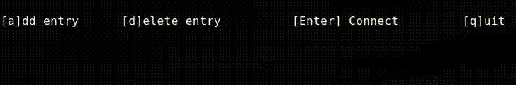

# **sshbook**

Minimal terminal-based SSH launcher with a persistent menu.

sshbook is a simple TUI tool for managing and launching SSH connections. It stores entries in a plain-text config file and lets you add, delete, and connect to hosts from a scrollable list — all in your terminal.
 Features

    Add, remove, and persist SSH entries

    Scrollable TUI menu with keyboard navigation

    Raw terminal mode for smooth input handling

    Uses a config file: ~/.config/sshbook/book

    Minimal dependencies, fast and lightweight

 Installation

Requirements

    C compiler (gcc, clang, etc.)

    Unix system (Linux, macOS, etc.)

Build & Install

    make
    sudo make install

This installs sshbook to /usr/local/bin/.

Usage
Run:

    sshbook

Controls

    ↑: Go upwards
    ↓: Go downwards
    [Enter] Select entry
    a: Add entry
    d: delete entry
    [Ctrl-c]: exit
